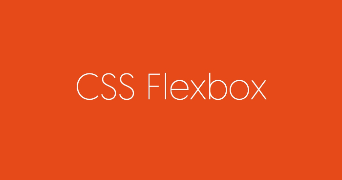

## flex 布局 


&emsp;&emsp;2009年，W3C 提出了一种新的方案----Flex 布局，可以简便、完整、响应式地实现各种页面布局。目前，它已经得到了所有浏览器的支持，这意味着，现在就能很安全地使用这项功能。

### 一、什么是 flex 布局

&emsp;&emsp;2009年，W3C 提出了一种新的方案----Flex 布局，可以简便、完整、响应式地实现各种页面布局。目前，它已经得到了所有浏览器的支持，这意味着，现在就能很安全地使用这项功能。

&emsp;&emsp;Flex 是 Flexible Box 的缩写，意为"弹性布局"，用来为盒状模型提供最大的灵活性。
flex 是一种新型的布局方式，使用该布局方式可以实现几乎所有你想要的效果。但是要注意其浏览器的兼容性，flex 只支持 ie 10+，所有还是要根据你的项目情况使用（没错，我们要求至少 ie 9）。


### 二、使用 flex 布局

&emsp;&emsp;flex 的使用方法很简单，只需要将其 display 属性设置为 flex 就可以，也可以设置行内的 flex，记得 Webkit 内核的浏览器，必须加上 -webkit 前缀。注意，设为 Flex 布局以后，子元素的 float、clear 和 vertical-align 属性将失效。

  ```
   .ele{
       display: -webkit-flex;
       display: flex;
       display: inline-flex;
       display: -webkit-inline-flex;
   }
  ```
&emsp;&emsp;采用 Flex 布局的元素，称为 Flex 容器（flex container），简称"容器"。它的所有子元素自动成为容器成员，称为 Flex 项目（flex item），简称"项目"。


&emsp;&emsp;容器默认存在两根轴：水平的主轴（main axis）和垂直的交叉轴（cross axis）。主轴的开始位置（与边框的交叉点）叫做main start，结束位置叫做main end；交叉轴的开始位置叫做cross start，结束位置叫做cross end。
项目默认沿主轴排列。单个项目占据的主轴空间叫做main size，占据的交叉轴空间叫做cross size。

